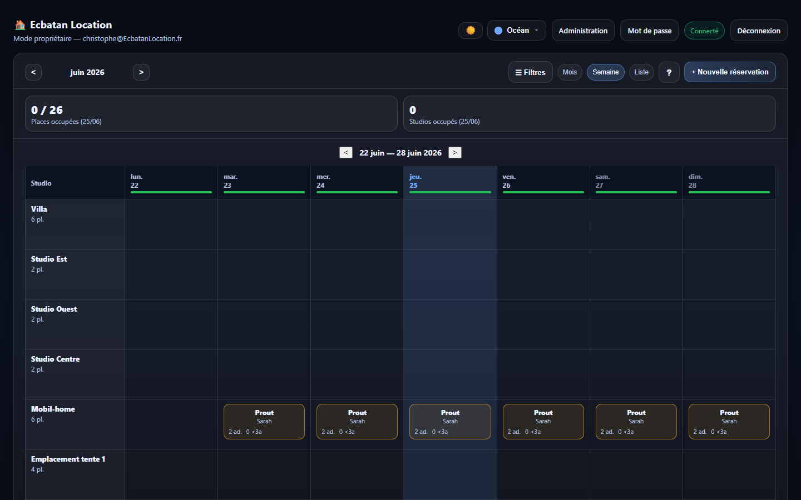
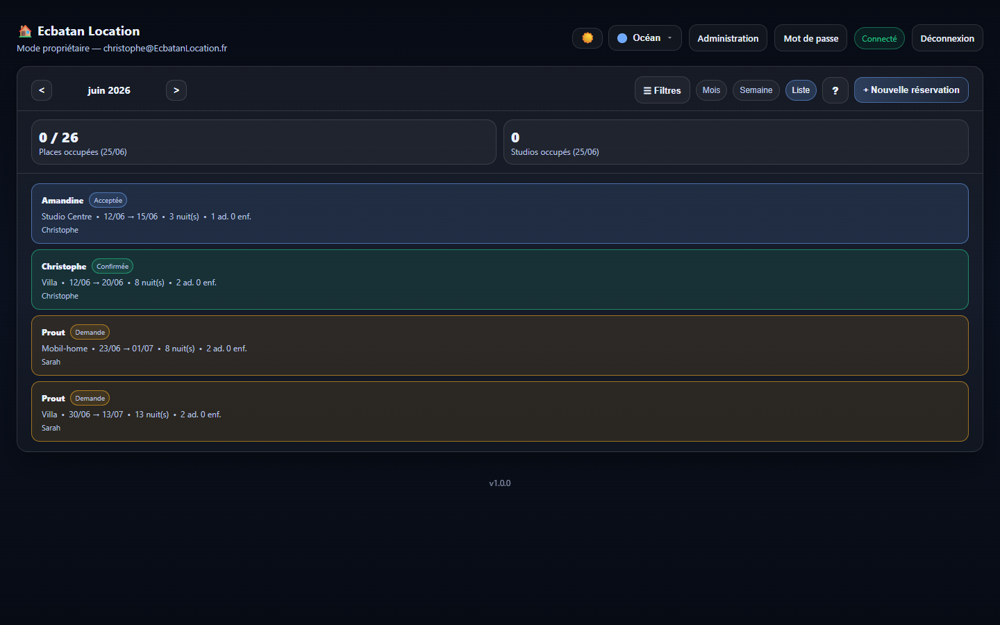
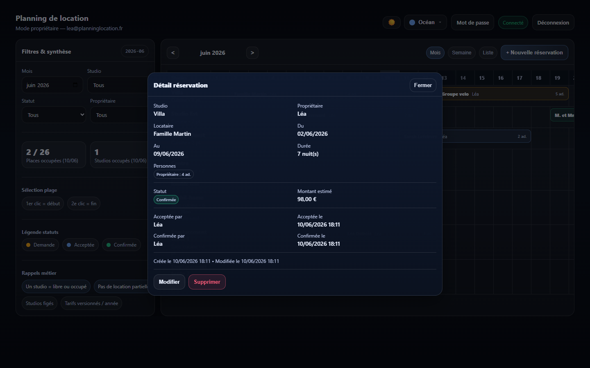
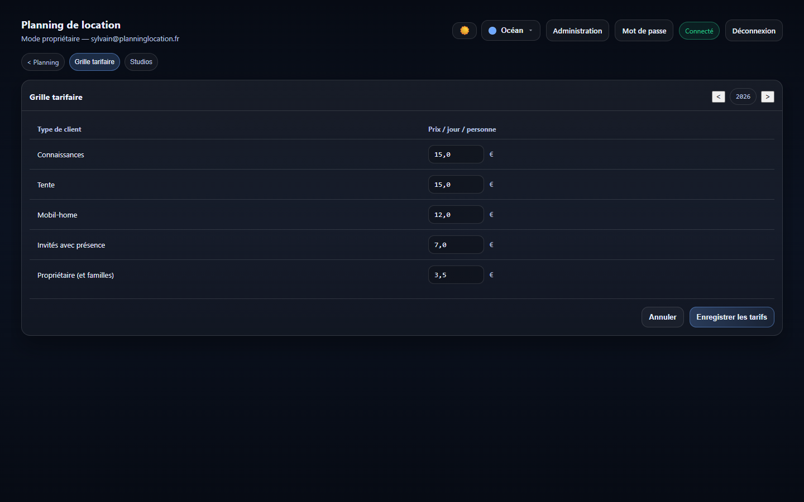

# Fonctionnalites
{: .fs-8 }

---

## Planning de location

### Vue mensuelle (par defaut)

Affiche un tableau avec les studios en lignes et les jours du mois en colonnes. Chaque reservation apparait avec un code couleur selon son statut.

| Couleur | Statut | Signification |
|---------|--------|---------------|
| Orange | Demande | Reservation en attente de validation |
| Bleu | Acceptee | Validee par un proprietaire |
| Vert | Confirmee | Confirmation finale |

### Vue semaine

Affiche le planning sur 7 jours avec plus d'espace par jour. Ideal pour voir le detail des reservations en cours.

### Vue liste

Affiche toutes les reservations du mois sous forme de liste triee par date d'arrivee.

---

## Gestion des reservations

### Creer une reservation

1. Cliquer sur **+ Nouvelle reservation**
2. Remplir le formulaire : studio, dates, locataire, personnes (type client, adultes, enfants)
3. Le montant estime se calcule automatiquement
4. La disponibilite est verifiee en temps reel (alerte si chevauchement)
5. Cliquer sur **Enregistrer**

### Workflow de statut

Le cycle de vie d'une reservation suit le workflow : **Demande** &rarr; **Acceptee** &rarr; **Confirmee**

Chaque transition enregistre le nom du proprietaire et la date/heure.

### Modifier ou supprimer

- Cliquer sur une reservation dans le planning pour voir le detail
- Utiliser les boutons **Modifier**, **Accepter/Confirmer** ou **Supprimer**

---

## Hebergements

7 hebergements avec capacites et caracteristiques variees :

| Nom | Capacite | Cuisine | Louable seul |
|-----|----------|---------|-------------|
| Villa | 6 | Oui | Oui |
| Studio Est | 2 | Oui | Oui |
| Studio Ouest | 2 | Oui | Oui |
| Studio Centre | 2 | Non | Non |
| Mobil-home | 6 | Non | Non |
| Emplacement tente 1 | 4 | Non | Oui |
| Emplacement tente 2 | 4 | Non | Oui |

{: .note }
Les studios marques "Non louable seul" ne peuvent etre reserves qu'en complement d'un studio independant sur les memes dates par le meme proprietaire.

---

## Tarification

Grille tarifaire versionnee par annee (prix/jour/personne) :

| Type client | Tarif 2026 |
|------------|-------|
| Proprietaire (et familles) | 3.50 EUR |
| Invites avec presence | 7.00 EUR |
| Connaissances | 15.00 EUR |
| Connaissances -3 ans (50%) | 7.50 EUR |
| Mobil-home | 12.00 EUR |
| Tente | 7.00 EUR |

La grille est modifiable par un administrateur.

---

## Filtres et KPIs

### Filtres disponibles

- **Mois** : selecteur de mois/annee
- **Studio** : filtrer par hebergement
- **Statut** : Demande / Acceptee / Confirmee
- **Proprietaire** : filtrer par proprietaire

### Indicateurs d'occupation

- **Places occupees / total** : nombre de places prises vs capacite totale
- **Studios occupes** : nombre de studios ayant au moins une reservation

Cliquer sur un jour ou selectionner une periode (2 clics) pour afficher le taux moyen d'occupation.

---

## Roles et droits

| Role | Droits |
|------|--------|
| Public (anonyme) | Consultation du planning en lecture seule |
| Proprietaire | Creation, modification, changement de statut des reservations |
| Admin | Gestion des tarifs et catalogue des studios |

---

## Apparence

- **Mode sombre / clair** : basculer avec le bouton dans l'en-tete
- **5 palettes de couleurs** : Ocean, Foret, Coucher de soleil, Amethyste, Rubis
- Le choix est conserve d'une visite a l'autre
