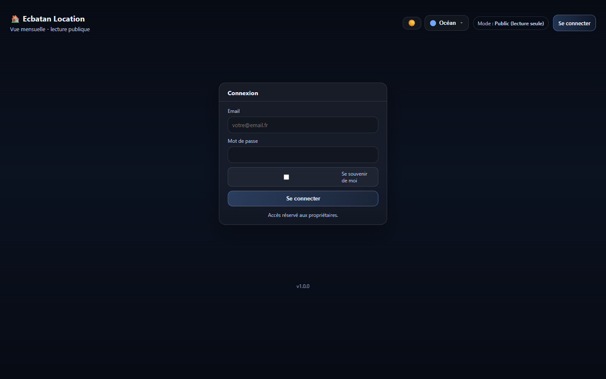
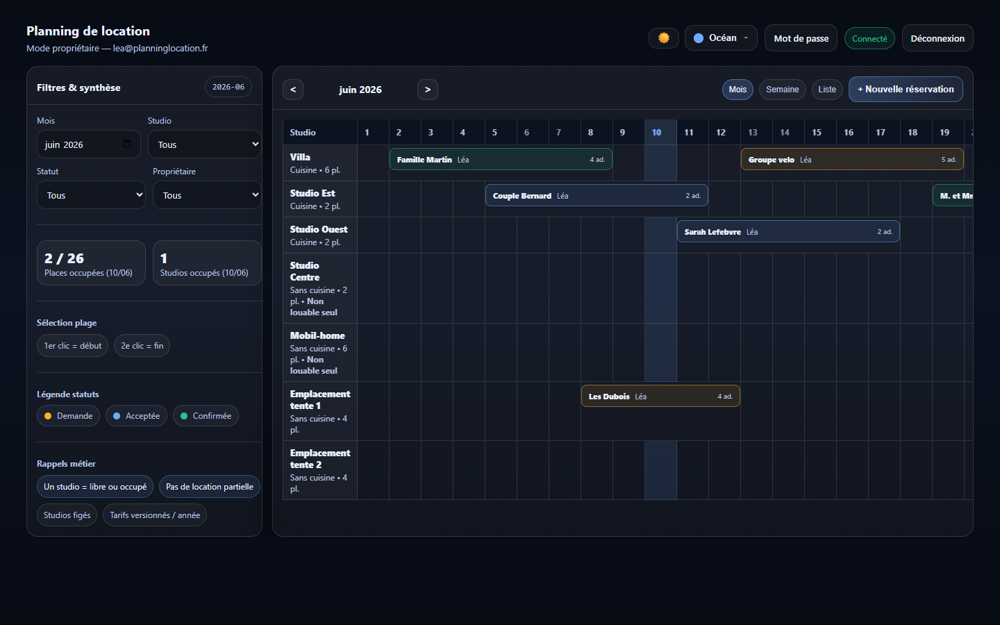
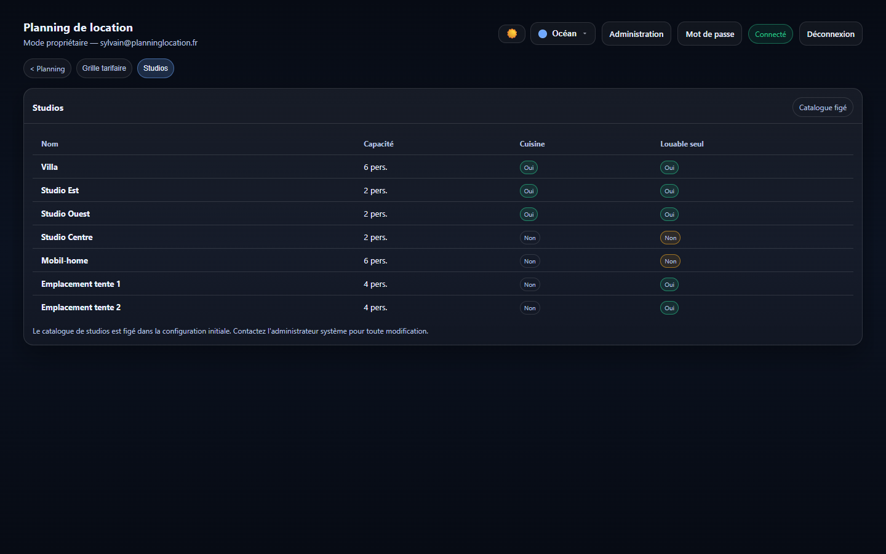

# Guide utilisateur
{: .fs-8 }

Comment utiliser Ecbatan Location au quotidien.
{: .fs-5 .fw-300 }

---

## Acces a l'application

### Mode public (lecture seule)

L'application est accessible sans compte. En mode public, vous pouvez :

- **Consulter le planning mensuel** : voir toutes les reservations par studio et par jour
- **Changer de mois** : utiliser les fleches autour du nom du mois
- **Filtrer les reservations** : par studio, statut ou proprietaire via la barre laterale
- **Voir le detail d'une reservation** : cliquer sur une reservation dans le planning
- **Consulter l'occupation** : cliquer sur un jour pour voir les KPIs

### Mode proprietaire (edition)

Cliquer sur **Se connecter** et saisir vos identifiants (email + mot de passe).

En mode connecte, vous avez acces a toutes les fonctionnalites de lecture, plus :

- Creer des reservations
- Modifier des reservations existantes
- Changer le statut des reservations
- Supprimer des reservations
- Changer votre mot de passe

---

## Vues du planning

### Vue Mois (par defaut)

Affiche un tableau avec les studios en lignes et les jours du mois en colonnes. Chaque reservation apparait avec un code couleur :

| Couleur | Statut | Signification |
|---------|--------|---------------|
| Orange | Demande | En attente de validation |
| Bleu | Acceptee | Validee par un proprietaire |
| Vert | Confirmee | Confirmation finale |

### Vue Semaine

Affiche le planning sur 7 jours avec plus d'espace par jour. Naviguer entre les semaines avec les fleches.

### Vue Liste

Toutes les reservations du mois sous forme de liste triee par date d'arrivee.

### Vue Agenda (mobile)

Sur smartphone, le planning bascule automatiquement vers une vue agenda adaptee au tactile (la bascule depend de la taille de l'ecran).

---

## Gerer les reservations

### Creer une reservation

1. Cliquer sur **+ Nouvelle reservation**
2. Remplir le formulaire :
   - **Studio** : choisir l'hebergement (la capacite et les contraintes sont rappelees)
   - **Dates** : date d'arrivee et de depart (le nombre de nuits s'affiche automatiquement)
   - **Nom du locataire** : nom complet de la personne
   - **Personnes** : une ou plusieurs lignes. Chaque ligne precise un **type de client**, un nombre d'**adultes** et un nombre d'**enfants < 3 ans**. Utiliser **+ Ajouter un type** pour combiner plusieurs tarifs.
3. Le montant estime se calcule automatiquement
4. La disponibilite est verifiee en temps reel (alerte si chevauchement)
5. Cliquer sur **Enregistrer**

La reservation est creee avec le statut **Demande**.

{: .note }
**Cas particuliers** : pour le Mobil-home et les emplacements de tente, le type de client est impose et une seule ligne de personnes est autorisee.

### Modifier une reservation

1. Cliquer sur une reservation dans le planning
2. Dans la modale de detail, cliquer sur **Modifier**
3. Modifier les champs souhaites
4. Cliquer sur **Enregistrer**

### Changer le statut

Le workflow est : **Demande** &rarr; **Acceptee** &rarr; **Confirmee**

1. Cliquer sur une reservation
2. Dans la modale de detail :
   - Si "Demande" : cliquer sur **Accepter**
   - Si "Acceptee" : cliquer sur **Confirmer**
3. Le changement est enregistre avec votre nom et la date/heure

### Supprimer une reservation

1. Cliquer sur une reservation
2. Cliquer sur **Supprimer**
3. Confirmer dans la modale de confirmation

---

## Filtres et KPIs

### Barre laterale

- **Mois** : selecteur de mois/annee
- **Studio** : filtrer par hebergement
- **Statut** : filtrer par Demande / Acceptee / Confirmee
- **Proprietaire** : filtrer par proprietaire

### Indicateurs (KPIs)

Par defaut, les indicateurs portent sur le jour courant. Cliquer sur un jour dans le planning pour afficher ses KPIs :

- **Places occupees / total** : places prises vs capacite totale
- **Studios occupes** : studios ayant au moins une reservation (Acceptee ou Confirmee)

### Selection d'une periode

Pour analyser l'occupation sur plusieurs jours :

1. Cliquer sur un premier jour (1er clic = debut)
2. Cliquer sur un second jour (2e clic = fin)

La barre laterale affiche le **taux moyen d'occupation** sur la periode. Utiliser la croix pour reinitialiser.

---

## Apparence

Le selecteur de theme est disponible pour tous (y compris en mode public) :

- **Mode sombre / clair** : basculer avec le bouton dans l'en-tete
- **Palette de couleurs** : Ocean, Foret, Coucher de soleil, Amethyste, Rubis

Le choix est conserve d'une visite a l'autre.

---

## Administration

{: .warning }
Accessible uniquement aux comptes ayant le role **Admin** (bouton **Administration** dans l'en-tete).

### Grille tarifaire

- Visualiser et modifier les tarifs par type de client pour chaque annee
- Naviguer entre les annees avec les fleches
- Creer une grille pour une nouvelle annee
- Les tarifs sont en euros par jour par personne

### Studios

- Visualiser le catalogue des studios (capacite, cuisine, louable seul)
- **Creer** ou **supprimer** un studio
- Marquer un studio **Indisponible** pour le retirer temporairement du planning

### Comptes proprietaires

- Gerer les comptes des proprietaires (onglet **Proprietaires** de l'administration)

### Rapport

- Generer un **rapport de reservations** avec calcul de prix par proprietaire et par statut
- **Exporter le rapport en PDF**

---

## Changer mon mot de passe

Une fois connecte, cliquer sur **Mot de passe** dans l'en-tete.

Saisir le mot de passe actuel, puis le nouveau (et sa confirmation).

Le mot de passe doit contenir au moins **8 caracteres, une majuscule, une minuscule et un chiffre**.

---

## Hebergements disponibles

| Nom | Capacite | Cuisine | Louable seul |
|-----|----------|---------|-------------|
| Villa | 6 | Oui | Oui |
| Studio Est | 2 | Oui | Oui |
| Studio Ouest | 2 | Oui | Oui |
| Studio Centre | 2 | Non | Non |
| Mobil-home | 6 | Non | Non |
| Emplacement tente 1 | 4 | Non | Oui |
| Emplacement tente 2 | 4 | Non | Oui |

---

## Comptes proprietaires

Les 4 comptes proprietaires sont : **Lea**, **Sarah**, **Jean**, **Christophe**. Les identifiants sont fournis par l'administrateur systeme.

Christophe dispose en plus du role **Admin** (acces a la grille tarifaire et au catalogue des studios).
