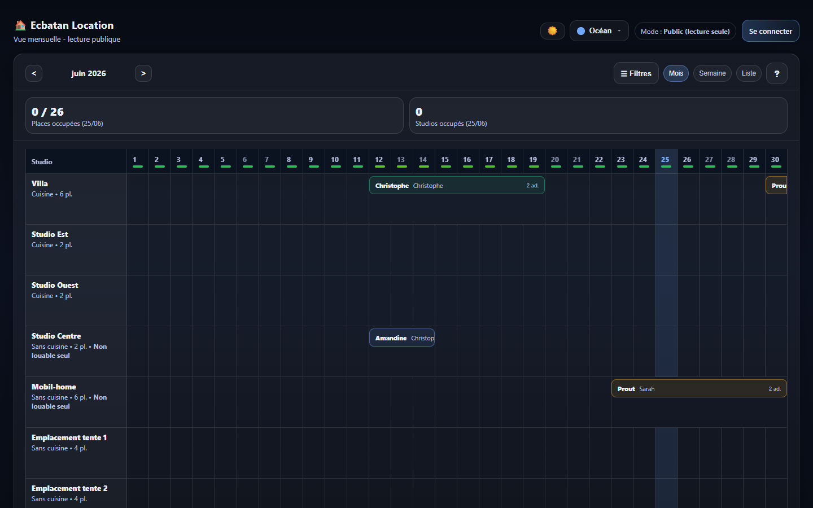
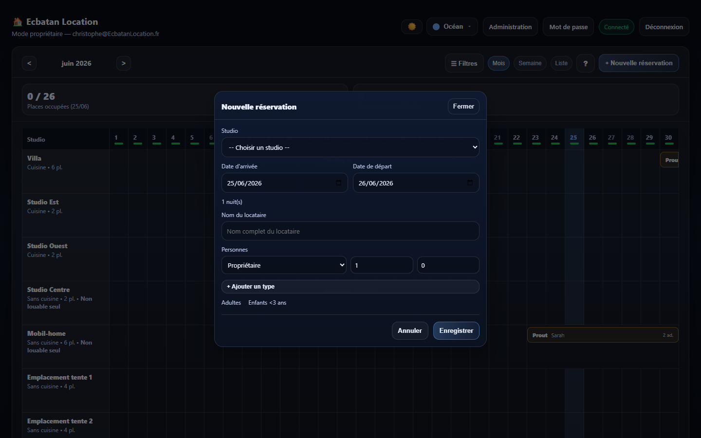

# Ecbatan Location
{: .fs-9 }

Application web de gestion de planning de location saisonniere pour une maison de vacances partagee entre 4 coproprietaires.
{: .fs-6 .fw-300 }

---

## A propos

Ecbatan Location permet aux 4 coproprietaires (Lea, Sarah, Jean, Christophe) de gerer le planning de location de leur maison de vacances. Le planning est consultable publiquement en lecture seule et editable par les proprietaires authentifies.

## Fonctionnalites cles

- **Planning interactif** avec vues mois, semaine, liste et agenda mobile
- **Gestion des reservations** avec workflow de validation (Demande, Acceptee, Confirmee)
- **7 hebergements** : Villa, Studios, Mobil-home, Emplacements tente
- **Tarification** versionnee par annee avec tarifs differencies par type de client
- **Rapport de reservations** avec calcul de prix et export PDF
- **KPIs d'occupation** en temps reel et code couleur de disponibilite
- **Theming** : mode sombre/clair avec 5 palettes de couleurs
- **Responsive** : PC et tablette

## Stack technique

| Couche | Technologie |
|--------|------------|
| Frontend | Blazor Server (.NET 10) |
| Backend | ASP.NET Core 10 |
| Authentification | ASP.NET Identity |
| Base de donnees | SQLite (dev) / PostgreSQL (prod) via EF Core |
| Architecture | DDD + CQRS (mediateur interne) |
| Tests | xUnit + FluentAssertions (129 tests) |
| CI/CD | GitHub Actions |

## Captures d'ecran

{: .mb-6 }

{: .mb-6 }
